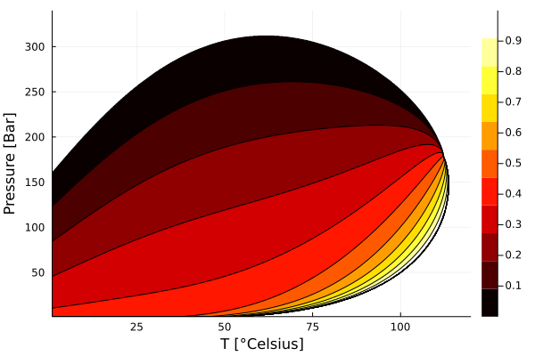
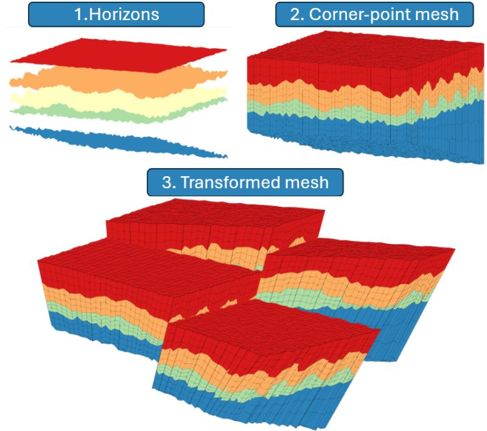

I enjoy writing software, and much of my work depends on high-quality software, usually with some flavor of automatic differentiation. This pages lists open source software where I am a maintainer. See also [my GitHub profile](https://github.com/moyner).

## MRST

The [MATLAB Reservoir Simulation Toolbox (MRST)](https://github.com/SINTEF-AppliedCompSci/MRST) is an [open source toolbox for simulation of flow, mechanics and transport in porous media](https://www.sintef.no/projectweb/mrst/) developed at [group for Applied Computational Science](https://www.sintef.no/en/digital/departments-new/department-of-mathematics-and-cybernetics/research-group-applied-computational-science/). The software has been used in over [1000 publications all over the world](https://www.sintef.no/projectweb/mrst/publications/).

## Jutul.jl

[Jutul.jl](https://github.com/sintefmath/Jutul.jl)  is a Julia framework for fully differentiable multiphysics simulators based on implicit finite-volume methods with automatic differentiation with integrated support for 3D visualization and adjoints. Used for several applications, including reservoir simulation, carbon capture, battery simulation and more.

## JutulDarcy.jl

[JutulDarcy.jl](https://github.com/sintefmath/JutulDarcy.jl) is the primary demonstrator for Jutul.jl: A fast and fully differentiable reservoir simulator with support for a wide range of meshes and physics. The package also has a Python wrapper: [pyjutuldarcy](https://github.com/sintefmath/PyJutulDarcy).

## BattMo.jl

BattMo.jl, built on top of Jutul.jl, is a Julia version of the BattMo toolbox. Supports fast simulation of pseudo X-dimensional (PXD) framework for the Doyle-Fuller-Newman model of lithium-ion battery cells on general meshes.

## MultiComponentFlash.jl

[MultiComponentFlash.jl](https://github.com/moyner/MultiComponentFlash.jl) implements several equations of state for multicomponent vapor-liquid equilibrium, also called flash, for mixtures. These can be used to determine vapor fractions, molar partition between the phases and predict properties such as density and volume.

## GeoEnergyIO.jl

[GeoEnergyIO.jl](https://github.com/sintefmath/GeoEnergyIO.jl) implements parsing of input formats from GeoEnergy applications (corner-point/GRDECL meshes, simulation input files and so on) as well as support for writing output in industry standard formats.

## SPE11 visualizer



The [CSP11Visualizer.jl](https://github.com/moyner/CSP11Visualizer.jl/) is used to generate the [static result website](https://moyner.github.io/SPE11-plot-test-deploy/index.html) for the [11th SPE Comparative Solutions Project on CO2 storage](https://spe.org/en/csp/spe11/).
