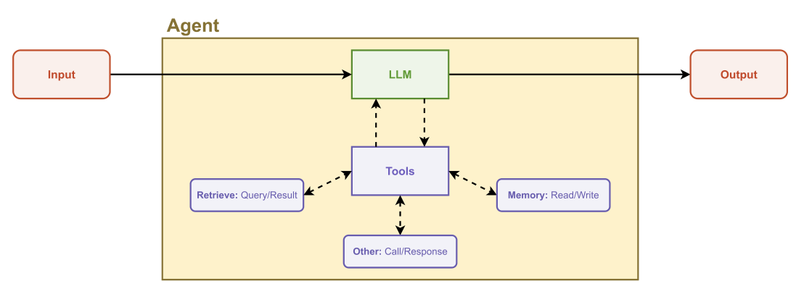
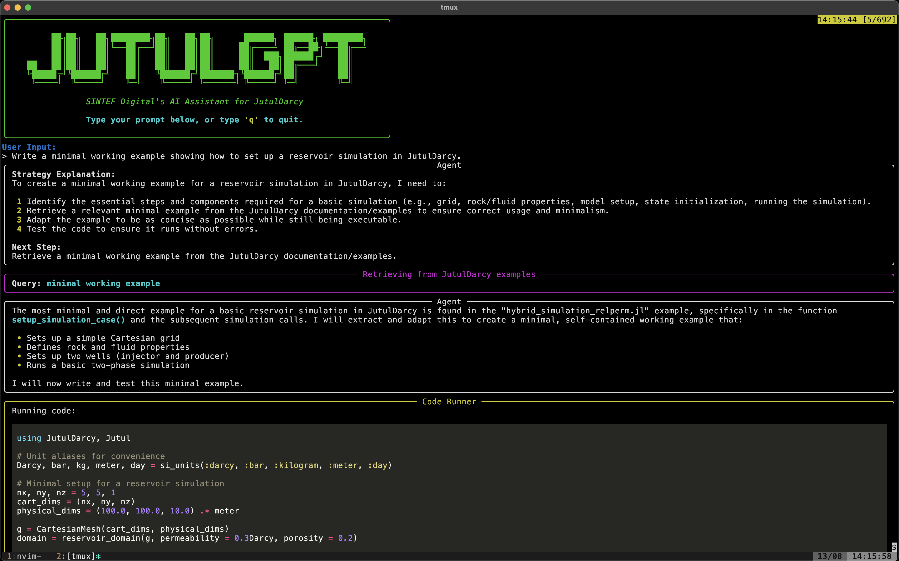
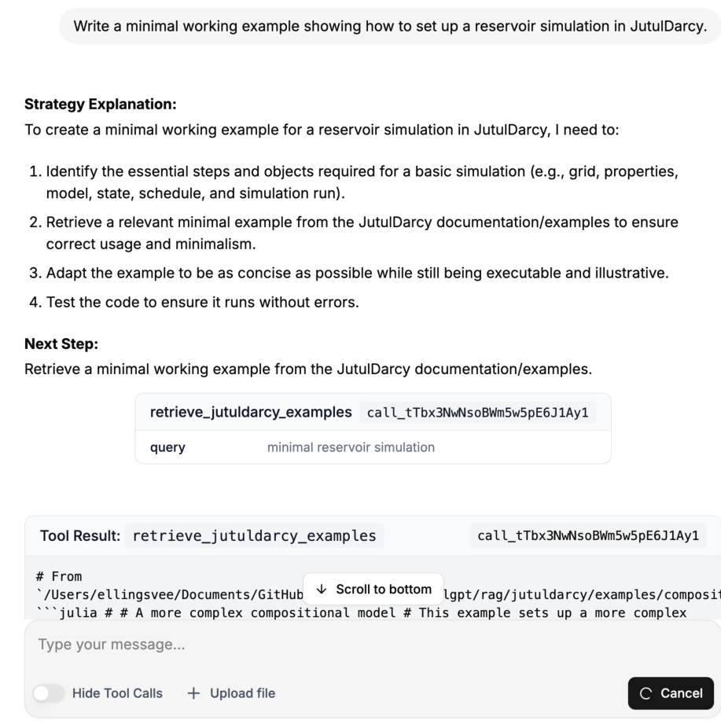

## Motivation

*This blog post is based on work together with Elling Svee (who did most of the coding!), Knut-Andreas Lie, Kjetil Lye Olsen and Jakob Torben. [code is available on GitHub](https://github.com/ellingsvee/JutulGPT).*

There is a fair bit of hype around large language model (LLM) agents at the moment, and discussions about what they can be used for. LLM-based agents are, in the broadest sense, essentially LLMs that are given a set of tools that can be used to perform tasks. Tools are typically a function call together with metadata (description of usage, purpose, etc) and allows a LLM program to perform tasks by estimating what the appropriate tool should be whenever a text response is insufficient.

At the Applied Computational Science group, we work extensively with numerical simulation of physical processes. We are developing open source software for reservoir simulation (e.g. MRST, OPM Flow and JutulDarcy.jl) as well as software for battery simulation and many other applications. In this post, we will limit the discussion to reservoir simulation, but most of the lessions apply to other types of modelling as well.

We are interested in exploring how agents can be used to set up and interact with complex simulation models, examplified by a reservoir simulator. We can break down a basic reservoir simulation workflow into four steps:

1. Define the model itself: Setting up a mesh, populating it with static properties (e.g. permeability/porosity), defining a fluid model and setting up wells, aquifers and other types of boundary conditions.
2. Set up a scenario to simulate: Pick operating controls/limits for the wells, time-steps to solve before simulating with the approprioate numerical tolerances, linear solver and solution strategy.
3. Perform analysis on the results, for example by computing the total thermal energy produced over a given number of years, examining the amount of CO2 stored in a CCS model, and so on.
4. Based on the analysis and goal, go back and redo steps 1-3 to improve the setup by introducing additional features, increasing grid resolution, adding tracers, moving wells, etc.

Reservoir simulators are complex pieces of software, and iterating between these four steps requires detailed knowledge of:

- Reservoir engineering: *What physical process am I modelling?*
- Reservoir simulation: *What is the right choice of physics and resolution to capture the process?*
- Specific software know-how: *How do I make the available software do what I want? What are the limitations? How do I transfer data between applications?*

Each topic can be a daunting field of study in itself, so there exists a substantial challenge when it comes to making these modelling workflows accessible, especially for experts who want to test a new code for an existing application. This workflow sketch is also intentionally a bit simplistic, and most experienced reservoir simulation readers will spot some missing details (where are the ensembles? What about seismic interpretation? Where do you get the fluid data? What method do you use for populating the properties?).

I have personally no expectation that LLMs are going to be replacing "PhD level intelligence" any time soon - but they seem to have potential as a research partner that can perform time-consuming tasks and condense information from documentation and technical sources very quickly. The goal is not to stop writing code, but to spend the time on the code that really matters. For this reason, we have an internal activity targeted towards use of LLMs with simulators. The goal is to allow a LLM to help with setting up simulations, looking up documentation and performing task-specific coding in steps 1 to 4 above.

For more information on the high level goals of this activity, have a look at the SINTEF page on [Discussing with your simulator](https://www.sintef.no/en/digital/departments/department-of-mathematics-and-cybernetics/research-group-applied-computational-science/discussing-with-your-simulator/).

## Building an agent for reservoir simulation

The best way to get started with technology is to build something, so this year we allocated one of our many talented summer student towards building a prototype agent for reservoir simulation. Up front, we knew that two months were unlikely to build the agents of our dreams, so the scope was initially limited to steps 1/2, i.e. setting up simulation models rather than analysis of the results.

### Picking a code

We also had the issue of *what* code was to be used. We have three open source reservoir simulators that were candidates:

- [MRST](https://github.com/SINTEF-AppliedCompSci/MRST) is a MATLAB-based toolbox for reservoir simulation and uses scripts to set up models, and has been around for a long time with a large number of different modules
- [OPM Flow](https://opm-project.org/) is a C++ based reservoir simulator that is run by industry standard input files
- [JutulDarcy.jl](https://github.com/sintefmath/JutulDarcy.jl) is a Julia-based reservoir simulator that also uses scripts as the primary setup

We considered working directly on the industry standard .DATA files, as all three codes can set up models this way, but these files are both enormously complex, and are limited to the model setup as analysis is usually done in another language or GUI anyway. We selected JutulDarcy.jl for two reasons:

1. [JutulDarcy.jl](https://github.com/sintefmath/JutulDarcy.jl) is easy to call from within an agent framework, since Julia is pretty easy to both install and call in a virtual machine.
2. [MRST](https://github.com/SINTEF-AppliedCompSci/MRST) has a large number of modules that have been written over the last 15 years, with code styles, interfaces and documentation that varies from module to module. This wide feature set is very valuable to researchers, but the magnitude means that it is less useful to a LLM, which has a limited context window and has a hard time with a non-unified coding style across modules.

### Software stack

After a bit of testing with smaller tools (like [PromptingTools.jl](https://github.com/svilupp/PromptingTools.jl)), we ended up using [LangChain](https://github.com/langchain-ai/langchain) as the framework. We picked LangChain since it seemed to be fairly mature, featured and could easily use locally hosted LLMs.

The [code is available on GitHub](https://github.com/ellingsvee/JutulGPT) for those who want to dig into the details.

Elling has made two interfaces for JutulGPT: A [chat-based frontend](https://github.com/ellingsvee/JutulGPT-GUI) based on the [LangGraph Agent Chat UI](https://github.com/langchain-ai/agent-chat-ui) that should be familiar if you have used e.g. ChatGPT, and a dedicated command line interface (CLI). The CLI is recommended if you are familiar with programming.

 

### Tools

An agent is defined by the available tools. Here is a brief rundown of the most important tools that Elling implemented.

#### Retrieval tools

- `grep_search`: Perform a text search in the documentation, returning a list of matches. The agent can then read the files containing the matches.
- `retrieve_function_documentation`: Get the docstring of a function, using the Julia `@doc` macro.
- `retrieve_examples`: Performs a semantic search to find relevant JutulDarcy examples stored in a
vector database. Full examples are embedded, which helps generate code for complete simulations.

#### Code execution tools

- `run_linter`: Run static analysis on generated code, verifying if it is valid Julia code that calls existing functions (but does not guarantee that the code actually runs).
- `run_julia_code`: Run the code and return any error messages.
- `execute_terminal_command`: Exactly what it says on the tin.

In addition, there are a set of tools for reading/writing to disk and accessing the file system.

### Human-in-the-loop

LLMs, especially those that can run locally, often make mistakes. Elling made a choice to include an optional "human-in-the-loop" feature. I think his report put it quite nicely, so I am just going to quote him directly:

> Providing the model with more tools can lead to more complex behavior. This often results in the model acting more autonomously, which can be both an advantage and a challenge. Smaller language models in particular tend to struggle with complex tasks. In my experience, they sometimes choose the wrong tools, get stuck on minor errors, or generate code that does not meet the user’s requirements. One way to address these issues is to include human feedback in the agent’s decision-making process, a method commonly referred to as human-
in-the-loop (HITL). This approach allows users to provide input and corrections, ensuring that
the agent’s actions align with their expertise.
>
> I have implemented HITL-interactions in the workflow and in many of the available tools. For example, when the agent retrieves information from the JutulDarcy documentation or examples, the user can review and filter the retrieved content. When the agent generates code based on user requirements, it presents the code to the user for review before execution. This gives the user an opportunity to make manual adjustments or suggest improvements.

## Experiences

### General

The first exploratory attempts used locally hosted LLM models together with a "one-shot" approach to generate all the code requested by the user where the entire script would be set up from a single query. This was not very successful, both because the self-hosted models on a normal consumer grade GPU are quite limited, and because generating a full example in a single go does not seem productive. The agent will either retrieve an example unmodified from the examples, or it will hallucinate non-working code.

In addition, even with GPT4.1, the one-shot approach had a tendency to include code in nonsensical ways. One example is the treatment of units: Realistic reservoir simulation in JutulDarcy.jl means setting up realistic units, and we ship the code with conversion factors for the standard units used in petroleum engineering, which is readily documented by usage in the examples. However, this is a bit underdocumented in the structured documentation. As a consequence, the agent would often insert usage of the [Unitful.jl](https://github.com/JuliaPhysics/Unitful.jl) library in the code. Unitful is a library for sending *typed* units through programs and does not contain any of the oil field units, leading to confusing errors.

The generated code became a lot better when the agent was allowed to iterate on the code before presenting it to the user, and make use of static linting. This removed a lot of the issues with hallucinated code, as the static linting will make it aware of what functions are actually available in the environment. This does burn more tokens, however, but it seems to be necessary to iterate to produce good results.

### Documentation and errors: What does the agent use?

The experience from MRST and JutulDarcy.jl usage is that typical users go straight for the examples and barely read the main documentation. We therefore focus on having long-form end-to-end example scripts ([example](https://sintefmath.github.io/JutulDarcy.jl/dev/examples/workflow/fully_differentiable_geothermal)) that can be a starting point for users. It was initially a bit surprising to see that these examples were not so useful for the LLM - the individual docstrings and text-based documentation were much more important to get good results. However, this does make sense, as the smaller parts are more digestable than a long example the LLM has a hard time to break down into chunks. We could perhaps make the examples more digestible by splitting it up. Similarly, writing high-quality error messages is worthwhile, as this is how the agent self-corrects during the write-evaluate loop.

### Surprise 1: The negative well radius

LLMs can often produce a lot of garbage code when given free reign, however, there are moments when they appear to be magic. One such instance happened during testing, when Kjetil had made a standardized prompt for testing different models, asking the model to set up a quarter-five-spot oil-water injection case on the unit square with 10 by 10 cells. This is a typical "hello world" reservoir simulation, if it were not for the fact that the domain is the unit square. If the mesh has unit length discretized by 10 cells, each cell is 0.1 meters wide, which is very small. In fact, it is smaller than the default diameter of the well in that grid block. This fact leads to a negative Peaceman factor - a standard analytical expression for the connection factor between a large grid block and the well inside it - and an error will occur.

The surprise? The LLM quickly explains exactly how this occurs and how to fix it by hinting that the size of the domain is not realistic. Somewhere in all the model weights there are some digested parts of classical reservoir simulation texts, and the retrieval into the right context feels like magic (I have a lot of old e-mails from students asking about the negative radius).

### Surprise 2: MPI-programming for agents

During user testing, one of my colleagues asked the agent to convert an existing simulation script into a MPI (distributed memory parallel) run. The agent managed to read the documentation, set up an environment with the required packages and modify the script in exactly the right places. It also set up a bash script to launch Julia with the right number of processes, pointing to the correct MPI binary. While this is documented in the [JutulDarcy.jl documentation on parallelism](https://sintefmath.github.io/JutulDarcy.jl/dev/man/advanced/mpi), the surgical modification of a user-provided script left me very impressed.

## Recommendations & conclusions

Although they are far from perfect programmers, agents seem to have significant potential for working with complex simulation codes. Here are a few of our (speculative) recommendations if you want to attempt something similar:

- Improve your docstrings and error messages as much as possible, and make these available to the agent. Make error messages for nonsensical inputs as early as possible rather than during the final simulation call (for example: Negative permeability is an error when input - even if it is a valid floating point number).
- Documentation should be smaller digestible chunks for the best results.
- Static analysis of code can save a lot of tokens and frustration

Even as the project was limited to only two months, we believe the resulting code can be quite useful, both as a novel tool for learning how to use JutulDarcy for reservoir simulation, and how to build an agent workflow for a simulation code. We encourage anyone who is interested to dig through or even run the code. The code is released under a permissive MIT license, just like JutulDarcy.jl itself.

### Links to source code and other material

[Source](https://github.com/ellingsvee/JutulGPT)
[Prompts](https://github.com/ellingsvee/JutulGPT/blob/main/src/jutulgpt/prompts.py)
[Additional details are found in Elling's report.](main.pdf)

If you do want to run the code: Please note that as the code can in principle execute terminal commands, we recommend that you carefully read the outputs before executing, ideally in some sort of VM.
